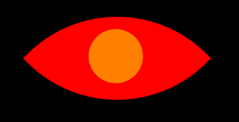

# Spooky Eyes

## Description
This was an assignment for my professional coding certificate with MIT xPro. We were provided the HTML and CSS code for one eye along with the javascript that makes the animation work. Our assignment was to add a second eye by modifying the divs. I decided to also change the colors to make the eyes a bit creepier!

## Future improvements
I want to figure out how to layer a pointed oval over the iris (CSS ball class). After spending an hour trying various different ways to layer it and also get it to move as part of the animation, I accepted that I need to study CSS quite a bit more before I will get there.

I also would like to animate the eyes closing when clicking on the page.

## How to run
Clone all files locally and open eyes.html in a browser.